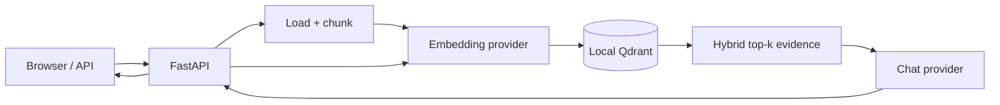

# Local RAG

[](https://github.com/Sanjaysrinivas/context-foundry/actions/workflows/ci.yml)
[](https://www.python.org/)
[](https://ollama.com/)
[](LICENSE)

A private-by-default retrieval-augmented generation application built with Python, Ollama, and embedded Qdrant. Upload local documents, retrieve semantically and lexically relevant passages, and generate grounded answers with visible citations—without a paid API or cloud database.

**[Explore the interactive architecture](https://sanjaysrinivas.github.io/context-foundry/)** · [Read the source HTML](docs/index.html) · [OpenAPI after startup](http://127.0.0.1:8000/docs)

## Why this project

This repository exposes the mechanics that RAG frameworks often hide:

1. extract text from PDF, Markdown, or plain text;
2. preserve headings and split it into deterministic overlapping chunks;
3. create embeddings through a replaceable provider;
4. fuse cosine similarity with keyword coverage and optional document filters;
5. assemble retrieved evidence into a guarded prompt;
6. generate an answer and return the evidence with scores.

Chat and embedding providers are selected independently. Ollama is the zero-cost default; any OpenAI-compatible local endpoint can replace either side without changing the pipeline.



## Stack

| Concern | Choice | Reason |
|---|---|---|
| Runtime and packages | Python 3.13 + `uv` | typed application code and a reproducible cross-platform lockfile |
| API and UI | FastAPI + vanilla HTML/CSS/JS | OpenAPI and a usable browser interface without a Node build |
| Chat | Ollama `llama3.2:3b` | a compact local model suited to retrieval and summarization |
| Embeddings | Ollama `embeddinggemma` | small multilingual local embedding model with batch support |
| Vector database | Qdrant local mode | persistent vector search with no server; same client supports a later remote Qdrant |
| Documents | PyMuPDF4LLM + RapidOCR + LangChain text splitters | layout-aware extraction, local OCR, and section-preserving chunks |
| Model transport | HTTPX | direct documented APIs and no orchestration-framework lock-in |
| Quality | Ruff, mypy, pytest, nox, pre-commit | identical checks locally and in GitHub Actions |

LangChain orchestration and LlamaIndex are intentionally absent. The project uses only LangChain's standalone text-splitter package; the current RAG loop is smaller than a framework abstraction.

## Quickstart

### 1. Install the local prerequisites

- [Install `uv`](https://docs.astral.sh/uv/getting-started/installation/).
- [Install Ollama](https://docs.ollama.com/quickstart). Windows users can use `OllamaSetup.exe`; the API then runs at `http://localhost:11434`.
- Use Ollama 0.11.10 or newer because `embeddinggemma` requires it.

Pull the free local models:

```powershell
ollama pull llama3.2:3b
ollama pull embeddinggemma
```

`llama3.2:3b` is the actual Ollama tag for the 3-billion-parameter model. The two downloads require roughly 2.7 GB of disk space in total.

### 2. Run the app

```powershell
git clone https://github.com/Sanjaysrinivas/context-foundry.git
cd context-foundry
uv sync --frozen
Copy-Item .env.example .env
uv run --env-file .env local-rag
```

On macOS or Linux, replace `Copy-Item` with `cp`. Open <http://127.0.0.1:8000>, upload a `.pdf`, `.md`, or `.txt` file, select the documents to search, and ask a question. Re-uploading a filename replaces its old chunks instead of leaving stale copies.

The browser interface is organized as an evidence desk: manage and select sources in the library, ask from the question workspace, then inspect the answer's numbered citation ledger with page references and hybrid relevance scores.

The application stores vectors beneath `data/qdrant`. Both `.env` and `data/` are ignored by Git.

## API

Upload a document:

```bash
curl -X POST http://127.0.0.1:8000/api/documents \
  -F "file=@notes.pdf"
```

List indexed documents with `GET /api/documents`. The response includes each content-addressed `document_id`, raw-file `source_sha256`, filename, page count, and chunk count. Clear and re-index documents created before this field was introduced.

Ask a grounded question:

```bash
curl -X POST http://127.0.0.1:8000/api/query \
  -H "Content-Type: application/json" \
  -d '{"question":"What are the main conclusions?","document_ids":["DOCUMENT_ID"]}'
```

The response keeps generation and retrieval separately inspectable:

```json
{
  "answer": "The document concludes that ... [1]",
  "citations": [
    {
      "document_id": "…",
      "source": "notes.pdf",
      "page": 4,
      "text": "Retrieved passage ...",
      "score": 0.82,
      "source_sha256": "0123456789abcdef..."
    }
  ]
}
```

Use `POST /api/retrieve` with the same request body to inspect retrieval without generation. Delete one document with `DELETE /api/documents/{document_id}`, or clear the collection with `DELETE /api/documents`. A full clear and re-index is required after changing embedding models because vectors from different embedding spaces cannot be mixed.

## Swap providers independently

Every setting is documented in [.env.example](.env.example). Valid provider values are `ollama` and `openai-compatible`.

For example, keep embeddings in Ollama while sending chat to an OpenAI-compatible local server such as LM Studio or LocalAI:

```dotenv
RAG_EMBEDDING_PROVIDER=ollama
RAG_EMBEDDING_MODEL=embeddinggemma

RAG_CHAT_PROVIDER=openai-compatible
RAG_OPENAI_BASE_URL=http://localhost:1234/v1
RAG_OPENAI_API_KEY=
RAG_CHAT_MODEL=your-loaded-chat-model
```

To swap embeddings instead, change `RAG_EMBEDDING_PROVIDER` and `RAG_EMBEDDING_MODEL`, clear the existing collection, and re-index the source documents. A remote compatible endpoint may incur charges and receives the data sent to it; that is outside the zero-cost/private default.

## Configuration

| Variable | Default | Purpose |
|---|---|---|
| `RAG_CHAT_PROVIDER` | `ollama` | chat adapter |
| `RAG_EMBEDDING_PROVIDER` | `ollama` | embedding adapter |
| `RAG_OLLAMA_BASE_URL` | `http://localhost:11434` | Ollama API root |
| `RAG_CHAT_MODEL` | `llama3.2:3b` | generation model |
| `RAG_EMBEDDING_MODEL` | `embeddinggemma` | embedding model |
| `RAG_DATA_DIR` | `data/qdrant` | persistent vector-store path |
| `RAG_CHUNK_SIZE` | `900` | characters per chunk |
| `RAG_CHUNK_OVERLAP` | `150` | repeated characters between chunks |
| `RAG_EMBEDDING_BATCH_SIZE` | `32` | chunks embedded per provider request |
| `RAG_TOP_K` | `4` | maximum passages retrieved |
| `RAG_SCORE_THRESHOLD` | `0.15` | minimum dense score before lexical fallback |
| `RAG_MAX_UPLOAD_MB` | `10` | upload boundary |
| `RAG_REQUEST_TIMEOUT` | `120` | model request timeout in seconds |

## Project layout

```text
src/local_rag/
├── api.py          # HTTP endpoints, browser UI, lifecycle
├── config.py       # validated environment configuration
├── documents.py    # PDF/text loading and chunking
├── evaluation.py   # golden-dataset runner and deterministic metrics
├── evaluation_data.py # silver generation, review, and gold release CLI
├── providers.py    # chat/embedding protocols and adapters
├── service.py      # ingestion and question-answering pipeline
├── store.py        # vector-store protocol and local Qdrant
└── web/index.html  # dependency-free UI
evaluation/         # public schema/example; private cases and results ignored
docs/
├── index.html      # publishable architecture document
└── evaluation.md   # quality measurement plan
tests/              # unit, API, provider, and Qdrant round-trip tests
```

## Development

```powershell
uv sync --frozen
uv run nox                 # lint + typecheck + tests
uv run pre-commit install --hook-type pre-commit --hook-type commit-msg
```

The test suite uses deterministic fake providers, plus a real embedded-Qdrant round trip. No model download or external API is needed in CI. Coverage is reported on every run with an enforced floor of 80%.

Development follows `feature/* → dev → main`. `dev` is the default integration branch; `main` contains release-ready snapshots. Commits use Conventional Commits, and python-semantic-release creates versions, changelog entries, tags, and GitHub Releases from pushes to `main`. See [CONTRIBUTING.md](CONTRIBUTING.md).

## Privacy and security

- In the default configuration, source text is sent only to Ollama on localhost and stored only in local Qdrant.
- Retrieved text is treated as untrusted data; the system prompt instructs the model to ignore instructions embedded in documents.
- Answers must cover each requested part from cited context, explicitly identify unsupported parts, and avoid filling gaps with model background knowledge.
- Upload extension and size are validated, and uploaded filenames are never used as filesystem destinations.
- Choosing a remote compatible endpoint changes the privacy boundary. Review that provider before sending documents.
- This demo has no authentication and binds to `127.0.0.1`. Do not expose it directly to a network.

See [SECURITY.md](SECURITY.md) for reporting and deployment guidance.

## Cost and scope

| Component | Required cost |
|---|---:|
| Ollama inference | $0; uses your hardware |
| Qdrant local storage | $0 |
| Python dependencies | $0; open source |
| GitHub Actions and Pages | $0 within the public-repository allowances |
| Cloud infrastructure | not used |

Pulumi, AWS, hosted model APIs, authentication, background workers, neural reranking, and multi-user tenancy are deferred. They add cost or operational weight without improving this local portfolio baseline. The [architecture](https://sanjaysrinivas.github.io/context-foundry/) lists the concrete triggers for each upgrade.

## Evaluation and limitations

The baseline uses layout-aware PyMuPDF4LLM extraction, automatic local RapidOCR fallback for scanned pages, Markdown-aware recursive chunking, and lightweight dense/keyword score fusion. It does not use a neural reranker and does not support concurrent ingestion from multiple processes. These limits are documented so improvements can be driven by evidence.

There is no generated “golden truth” for every chunk. Ingestion now records the raw source SHA-256 and carries it through pages, chunks, document responses, and citations. A separate, versioned JSONL dataset anchors expected evidence to source hashes, pages, stable text, optional coordinates, and evidence groups. Only `approved_gold` cases enter release metrics; future automatically generated cases remain synthetic silver until reviewed.

The deterministic evaluator reports Hit@k, MRR, evidence recall, required-evidence coverage, nDCG, citation precision, fact coverage, evidence support, abstention errors, and p50/p95 latency. With the matching corpus indexed and the app running, execute `uv run local-rag-eval path\to\cases.jsonl`. See [docs/evaluation.md](docs/evaluation.md) for the schema, review states, gates, and versioning protocol.

Use `uv run local-rag-eval-data generate source.pdf evaluation/private/candidates.jsonl` to create optional synthetic silver candidates after ingestion. The same CLI validates cases, hides proposed answers during source-first review, records approvals or rejections, and freezes only `approved_gold` records into a release dataset. It adds no cloud service or evaluation framework.

## License

[MIT](LICENSE)
