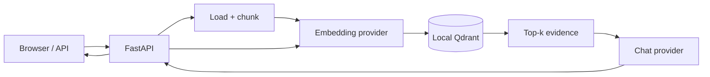

# Local RAG

[](https://github.com/Sanjaysrinivas/local-rag/actions/workflows/ci.yml)
[](https://www.python.org/)
[](https://ollama.com/)
[](LICENSE)

A private-by-default retrieval-augmented generation application built with Python, Ollama, and embedded Qdrant. Upload local documents, retrieve semantically relevant passages, and generate grounded answers with visible citations—without a paid API or cloud database.

**[Explore the interactive architecture](https://sanjaysrinivas.github.io/local-rag/)** · [Read the source HTML](docs/index.html) · [OpenAPI after startup](http://127.0.0.1:8000/docs)

## Why this project

This repository exposes the mechanics that RAG frameworks often hide:

1. extract text from PDF, Markdown, or plain text;
2. split it into deterministic overlapping chunks;
3. create embeddings through a replaceable provider;
4. persist and search vectors with cosine similarity;
5. assemble retrieved evidence into a guarded prompt;
6. generate an answer and return the evidence with scores.

Chat and embedding providers are selected independently. Ollama is the zero-cost default; any OpenAI-compatible local endpoint can replace either side without changing the pipeline.



## Stack

| Concern | Choice | Reason |
|---|---|---|
| Runtime and packages | Python 3.13 + `uv` | typed application code and a reproducible cross-platform lockfile |
| API and UI | FastAPI + vanilla HTML/CSS/JS | OpenAPI and a usable browser interface without a Node build |
| Chat | Ollama `llama3.2:3b` | a compact local model suited to retrieval and summarization |
| Embeddings | Ollama `embeddinggemma` | small multilingual local embedding model with batch support |
| Vector database | Qdrant local mode | persistent vector search with no server; same client supports a later remote Qdrant |
| Documents | standard library + `pypdf` | no parser dependency for text/Markdown; focused PDF support |
| Model transport | HTTPX | direct documented APIs and no orchestration-framework lock-in |
| Quality | Ruff, mypy, pytest, nox, pre-commit | identical checks locally and in GitHub Actions |

LangChain and LlamaIndex are intentionally absent. The current RAG loop is smaller than the abstraction required to hide it. Add a framework only when real integrations justify the dependency.

## Quickstart

### 1. Install the local prerequisites

- [Install `uv`](https://docs.astral.sh/uv/getting-started/installation/).
- [Install Ollama](https://docs.ollama.com/quickstart). Windows users can use `OllamaSetup.exe`; the API then runs at `http://localhost:11434`.
- Use Ollama 0.11.10 or newer because `embeddinggemma` requires it.

Pull the free local models:

```powershell
ollama pull llama3.2:3b
ollama pull embeddinggemma
```

`llama3.2:3b` is the actual Ollama tag for the 3-billion-parameter model. The two downloads require roughly 2.7 GB of disk space in total.

### 2. Run the app

```powershell
git clone https://github.com/Sanjaysrinivas/local-rag.git
cd local-rag
uv sync --frozen
Copy-Item .env.example .env
uv run --env-file .env local-rag
```

On macOS or Linux, replace `Copy-Item` with `cp`. Open <http://127.0.0.1:8000>, upload a `.pdf`, `.md`, or `.txt` file, and ask a question.

The application stores vectors beneath `data/qdrant`. Both `.env` and `data/` are ignored by Git.

## API

Upload a document:

```bash
curl -X POST http://127.0.0.1:8000/api/documents \
  -F "file=@notes.pdf"
```

Ask a grounded question:

```bash
curl -X POST http://127.0.0.1:8000/api/query \
  -H "Content-Type: application/json" \
  -d '{"question":"What are the main conclusions?"}'
```

The response keeps generation and retrieval separately inspectable:

```json
{
  "answer": "The document concludes that ... [1]",
  "citations": [
    {
      "source": "notes.pdf",
      "page": 4,
      "text": "Retrieved passage ...",
      "score": 0.82
    }
  ]
}
```

Clear the vector collection with `DELETE /api/documents`. This is required after changing embedding models because vectors from different embedding spaces cannot be mixed.

## Swap providers independently

Every setting is documented in [.env.example](.env.example). Valid provider values are `ollama` and `openai-compatible`.

For example, keep embeddings in Ollama while sending chat to an OpenAI-compatible local server such as LM Studio or LocalAI:

```dotenv
RAG_EMBEDDING_PROVIDER=ollama
RAG_EMBEDDING_MODEL=embeddinggemma

RAG_CHAT_PROVIDER=openai-compatible
RAG_OPENAI_BASE_URL=http://localhost:1234/v1
RAG_OPENAI_API_KEY=
RAG_CHAT_MODEL=your-loaded-chat-model
```

To swap embeddings instead, change `RAG_EMBEDDING_PROVIDER` and `RAG_EMBEDDING_MODEL`, clear the existing collection, and re-index the source documents. A remote compatible endpoint may incur charges and receives the data sent to it; that is outside the zero-cost/private default.

## Configuration

| Variable | Default | Purpose |
|---|---|---|
| `RAG_CHAT_PROVIDER` | `ollama` | chat adapter |
| `RAG_EMBEDDING_PROVIDER` | `ollama` | embedding adapter |
| `RAG_OLLAMA_BASE_URL` | `http://localhost:11434` | Ollama API root |
| `RAG_CHAT_MODEL` | `llama3.2:3b` | generation model |
| `RAG_EMBEDDING_MODEL` | `embeddinggemma` | embedding model |
| `RAG_DATA_DIR` | `data/qdrant` | persistent vector-store path |
| `RAG_CHUNK_SIZE` | `900` | characters per chunk |
| `RAG_CHUNK_OVERLAP` | `150` | repeated characters between chunks |
| `RAG_TOP_K` | `4` | maximum passages retrieved |
| `RAG_SCORE_THRESHOLD` | `0.25` | minimum cosine similarity |
| `RAG_MAX_UPLOAD_MB` | `10` | upload boundary |
| `RAG_REQUEST_TIMEOUT` | `120` | model request timeout in seconds |

## Project layout

```text
src/local_rag/
├── api.py          # HTTP endpoints, browser UI, lifecycle
├── config.py       # validated environment configuration
├── documents.py    # PDF/text loading and chunking
├── providers.py    # chat/embedding protocols and adapters
├── service.py      # ingestion and question-answering pipeline
├── store.py        # vector-store protocol and local Qdrant
└── web/index.html  # dependency-free UI
docs/
├── index.html      # publishable architecture document
└── evaluation.md   # quality measurement plan
tests/              # unit, API, provider, and Qdrant round-trip tests
```

## Development

```powershell
uv sync --frozen
uv run nox                 # lint + typecheck + tests
uv run pre-commit install --hook-type pre-commit --hook-type commit-msg
```

The test suite uses deterministic fake providers, plus a real embedded-Qdrant round trip. No model download or external API is needed in CI. Current coverage is 89%, with an enforced floor of 80%.

Development follows `feature/* → dev → main`. `dev` is the default integration branch; `main` contains release-ready snapshots. Commits use Conventional Commits, and python-semantic-release creates versions, changelog entries, tags, and GitHub Releases from pushes to `main`. See [CONTRIBUTING.md](CONTRIBUTING.md).

## Privacy and security

- In the default configuration, source text is sent only to Ollama on localhost and stored only in local Qdrant.
- Retrieved text is treated as untrusted data; the system prompt instructs the model to ignore instructions embedded in documents.
- Upload extension and size are validated, and uploaded filenames are never used as filesystem destinations.
- Choosing a remote compatible endpoint changes the privacy boundary. Review that provider before sending documents.
- This demo has no authentication and binds to `127.0.0.1`. Do not expose it directly to a network.

See [SECURITY.md](SECURITY.md) for reporting and deployment guidance.

## Cost and scope

| Component | Required cost |
|---|---:|
| Ollama inference | $0; uses your hardware |
| Qdrant local storage | $0 |
| Python dependencies | $0; open source |
| GitHub Actions and Pages | $0 within the public-repository allowances |
| Cloud infrastructure | not used |

Pulumi, AWS, hosted model APIs, authentication, background workers, reranking, and multi-user tenancy are deferred. They add cost or operational weight without improving this local portfolio baseline. The [architecture](https://sanjaysrinivas.github.io/local-rag/) lists the concrete triggers for each upgrade.

## Evaluation and limitations

The baseline deliberately uses character chunking, vector similarity, and no reranker. It does not perform OCR, parse scanned PDFs, preserve tables, or support concurrent ingestion from multiple processes. These limits are documented so improvements can be driven by evidence.

See [docs/evaluation.md](docs/evaluation.md) for the retrieval and grounded-answer metrics planned against a curated question set.

## License

[MIT](LICENSE)
