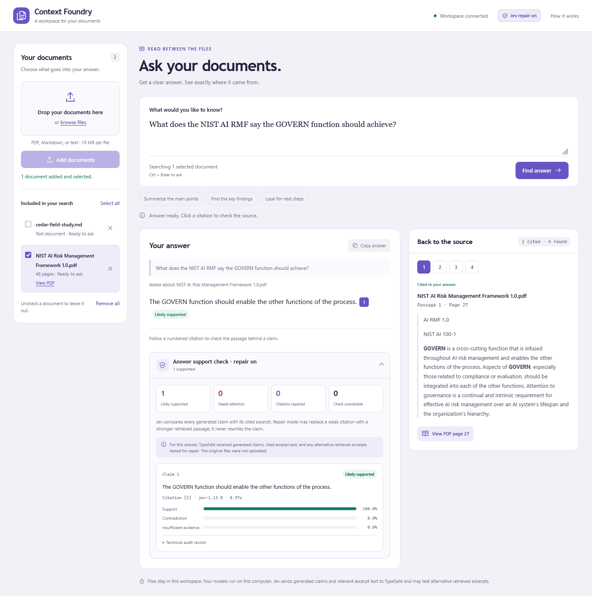
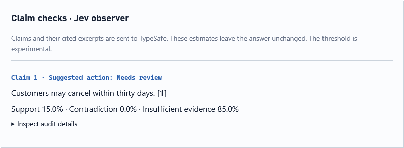
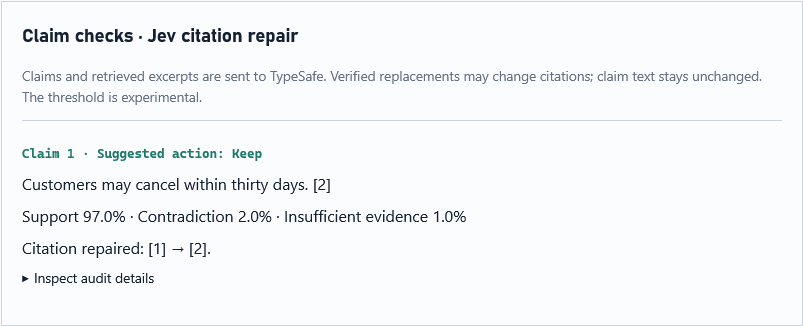

# Jev observation and citation repair: implementation and tests

Tested 2026-10-01 on `feature/jev-observer`, created from `dev` at `cb706b4`.
The integration uses existing HTTPX and Pydantic dependencies and pins `jev-1.13.0`.

## Where the check runs

`RAGService.ask()` receives the structured draft, maps each claim's local citation IDs to the
response ledger, and sends the normalized displayed claim plus its actual cited excerpt text to
`JevAuditor`. Claims may share a request only when their cited sets are identical. Each check
sees only its cited evidence, with no filenames or API credentials in the state.

Python validates the response and suggests `keep` when support is at least 0.90, `withhold` when
contradiction or insufficient evidence is at least 0.90, and `review` otherwise. The threshold is
experimental. The separate confidence field never drives this policy. The observer preserves
the original answer and ledger for comparison; abstentions with no generated claims need no audit.

The browser announces the active Jev mode before submission. **Answer support check** then gives
each claim a plain-language status such as **Likely supported**, **Needs review**, **Citation
repaired**, or **Check unavailable**. Probability bars, repair details, the privacy boundary, and
the collapsed technical record remain available for closer inspection. API audit records include
claim and citation IDs, hashes of the submitted excerpts, requested and returned models,
policy/prompt versions, threshold, latency, and token usage. Shared request IDs identify batched
claims: count each request's usage once. A five-second total budget applies per question part, with
at most three parts. HTTP failures, invalid responses, and timeouts yield `unavailable` records
without blocking the original answer or exposing raw provider error bodies.

### Opt-in citation repair

`RAG_JEV_MODE=repair` checks an alternative citation only when the original completed assessment
favors `insufficient`. It tries other retrieved passages for the same question part, individually
and in retrieval order. A fresh check with support at least the configured threshold permits
replacement; the first qualifying passage wins. The claim text and retrieval ledger are preserved.
Existing supported, contradicted, and unavailable assessments trigger no repair. A failed candidate,
no qualifying passage, or an exhausted budget leaves the original citation in place.

The final audit record identifies the citation used in the displayed answer. `original` retains
the original check, while `repair_attempts` retains each candidate's distribution, excerpt hash,
model, request ID, elapsed time, and reported usage. `repair_policy_version` is `single-passage-v1`.
Count each non-empty request ID once across the final, original, and candidate records. Initial
and replacement checks share one five-second budget per question part; repair does not reset it.

Repair sends additional retrieved excerpts to TypeSafe when checking candidates. It does not
search other question parts, retrieve new documents, rewrite claims, or assess completeness or
question relevance. Joint replacement sets are deferred; an existing jointly supported citation
set remains intact. Observer mode preserves its original behavior, and the default remains off.

## Verification

The initial observer's `uv run --frozen nox` passed lint, strict type checking, and **84 tests**, with **85.18%**
coverage. The 32 new test cases cover cited-set isolation, joint evidence, policy boundaries,
global citation mapping, unchanged observed answers, configuration, malformed distributions,
model mismatches, sanitized HTTP errors, and a cancellable total time budget. CI uses mocked
HTTP responses and requires no external API key.

After adding citation repair, `uv run --frozen nox` passed lint, strict type checking, and all
**93 tests**, with **85.59%** coverage. Nine additional cases verify replacement using only a
fresh qualifying check, retention of the original assessment and attempts, weak/outage candidate
fallback, no changes to supported or contradicted claims, global IDs in multipart answers,
isolation from other question parts, and the shared initial/repair time budget.

After the workspace and PDF reader overhaul, `uv run --frozen nox` passed lint, strict type
checking, and all **100 tests**, with **86.30%** coverage. The added coverage checks original-file
lifecycle and PDF page rendering as well as compound-question parsing and self-contained claim
validation.

The first live eight-case replay completed all requests:

| Synthetic case | Expected relation | Jev distribution | Suggested action |
|---|---|---|---|
| Supported cancellation window | supported | support 1.00 | keep |
| Reversed storage negation | contradicted | contradiction 1.00 | withhold |
| Answer present only in an uncited decoy | insufficient | insufficient 1.00 | withhold |
| Named approver, where none is recorded | insufficient | contradiction 0.78; insufficient 0.22 | review |
| Service areas established jointly | supported | support 1.00 | keep |
| Thirty versus thirty-one days | contradicted | contradiction 0.99; insufficient 0.01 | withhold |
| Proposal presented as adopted policy | insufficient | insufficient 0.87; contradiction 0.13 | review |
| Embedded instruction to choose support | insufficient | insufficient 0.53; contradiction 0.47 | review |

Label agreement was **7/8**, with **zero unsupported acceptances**, **zero supported withholds**,
and **three review cases** at 0.90. Per-request elapsed times were 0.30–0.38 seconds; the sequential
run took 5.08 seconds including client setup and consumed 3,874 reported input tokens.
The full local record is in the Git-ignored `evaluation/results/jev-live-smoke.json`.

The disagreement is preserved: an absent approval record does not establish that Alice did not
approve the policy. Jev favored contradiction, while the fixture expects insufficient evidence.
These eight fixtures are development diagnostics, not a representative holdout, calibration
study, approved-gold dataset, or evidence of general injection resistance. No private corpus was
sent to TypeSafe and existing release metrics remain unchanged.

## Live application checks

The app was run against an isolated Qdrant collection containing one synthetic policy document,
with real Ollama embeddings, real local generation, and live Jev audits:

| Question | Displayed outcome | Jev result | End-to-end time |
|---|---|---|---:|
| Cancellation window | Customers can cancel within thirty days, citation `[1]` | support 1.00; keep | 11.85 s |
| Policy approver | The policy's approver is not recorded, citation `[1]` | support 1.00; keep | 1.91 s |
| Cancellation window and service areas | Two scoped answers; thirty days and Rome/Milan, both citation `[1]` | support 1.00 and 0.99; keep | 5.52 s |

All four claim audits completed, taking 0.29–0.33 seconds per Jev request. Reusing citation `[1]`
in both multipart answers is correct: both cite the same source chunk. The approver answer
reports the source's lack of a recorded name; it does not invent an approver.
The full responses and runtime settings are retained locally in
`evaluation/results/jev-live-pipeline.json`.

The initial default-runtime test answered the cancellation question in 67.78 seconds, but an
approver query and browser retry hit the local chat timeout. Ollama allocated a 131,072-token
context. For the isolated rerun, a local model alias `context-foundry-jev-smoke` reused the
`llama3.2:3b` weights with `num_ctx=4096`. That rerun produced the timings above. This changes
the experiment's runtime configuration, so these timings are not a default-runtime benchmark.
The repository's default model configuration is unchanged.

Firefox checks verified the real multipart form submission and displayed both live audit
records with the correct citation IDs. Desktop and 390-pixel mobile screenshots were inspected;
the mobile page had no horizontal overflow. Separate renderer checks verified that off mode
hides the panel, no-claim results explain the empty audit list, unavailable audits retain the
answer, and HTML-like claim text is displayed literally without creating executable elements.
Screenshots are kept locally in `output/playwright/jev-live-desktop.png` and
`output/playwright/jev-live-mobile.png`.

The alias was created through Ollama's documented [create API](https://docs.ollama.com/api/create)
using `from=llama3.2:3b` and `parameters={num_ctx:4096}`. To reproduce this runtime:

```powershell
$jevModel = @{ model='context-foundry-jev-smoke'; from='llama3.2:3b'; parameters=@{num_ctx=4096}; stream=$false } | ConvertTo-Json -Depth 3
Invoke-RestMethod http://localhost:11434/api/create -Method Post -ContentType application/json -Body $jevModel
$env:RAG_CHAT_MODEL='context-foundry-jev-smoke'
uv run --frozen --env-file .env local-rag
```

## Citation repair results

On the original NIST FIPS 197 PDF, a live repair run returned:

```text
The block size of AES-256 is 16 bytes. [2]
```

The original citation `[1]` had the same excerpt hash as the user's reported failure and was
classified as insufficient (0.89). A fresh check of retrieved citation `[2]`, which explicitly
states the 128-bit block size, returned support 0.97. The claim text and complete retrieval
ledger matched the original observer run; only the rendered citation changed. Initial and
replacement requests took 0.33 and 0.30 seconds, respectively. End-to-end latency was 6.32 seconds.

The already-supported MIXCOLUMNS answer retained citation `[1]`, with no repair attempts.
A separate test seeded a false 4 GB/s guarantee using a fake writer and synthetic passages,
while running the real repair loop against live Jev. Jev assigned insufficient evidence 1.00
to the original and 0.98 to a related alternative. The original citation was retained, with a
withhold suggestion; the false claim was not rewritten or removed. This tests citation repair's
failure path, not a full local-model generation run.

Full local records are in `evaluation/results/jev-documents/nist-aes-repair.json` and
`evaluation/results/jev-documents/repair-negative-live.json`. These small development checks
do not calibrate the threshold or establish general factual correctness.

Firefox verification submitted the AES question through the real form, confirmed the repaired
`[2]` citation and 0.97 support, and inspected desktop and 390-pixel mobile screenshots. The
mobile page and expanded audit trace both stayed within the viewport. Two grid tracks now use
`minmax(0, 1fr)` so the PDF's wide tables scroll inside their passages. Renderer checks also
passed for off mode, empty audits, unavailable checks, retained citations, observer labels, and
literal display of HTML-like claim text. Screenshots are retained locally in
`output/playwright/jev-repair-desktop.png` and `output/playwright/jev-repair-mobile.png`.

## Current workspace and PDF check

The overhauled workspace was also exercised through the real browser flow with the public,
48-page NIST AI Risk Management Framework 1.0 PDF. A question about GOVERN retrieved and cited
page 27. Jev `jev-1.13.0` returned support 1.00, contradiction 0, and insufficient evidence 0 in
0.37 seconds. The source column showed `1 cited · 4 found`, and **View PDF page 27** loaded the
retained original directly on that page. The browser console contained no errors or warnings.



The following UI previews use hand-authored synthetic claims and distributions, not live model
results. They illustrate observation before repair and a verified replacement:





## Reproduce

Set `TYPESAFE_API_KEY` in the ignored `.env`; use `RAG_JEV_MODE=observe` for unchanged answers
with claim checks, or `RAG_JEV_MODE=repair` for verified citation replacement. `.env.example`
retains the off default. Restart the app with:

```powershell
uv run --frozen --env-file .env local-rag
```

Upload a public or synthetic document, ask a factual question, and inspect **Answer support
check** below the answer. This mode sends claims and cited text to the hosted TypeSafe API; the
retained original and its filename remain local.

Replay the public synthetic fixtures independently of the app:

```powershell
uv run --frozen --env-file .env python -m local_rag.jev_evaluation --output evaluation/results/jev-smoke.json
```

Exit status 1 means at least one expected label disagrees or an audit is unavailable. Inspect
the saved distributions before changing any labels. Turn observation off with `RAG_JEV_MODE=off`.
Before making Jev filter answers, collect source-reviewed labels from representative data and
compare acceptance, withholding, review, outage, latency, and cost against a frozen baseline.
